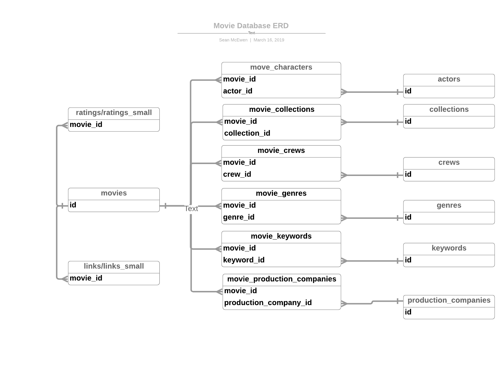

# Guild Data Engineering Project
### Task 1: Schema Design

Given that the requirements were to design a data model that 
serves as a source to a REST API, I designed a transactional normalized
schema.  This gives us more flexibility to meet the needs of our API if 
we want to provide various endpoints to return data in various different structures.

See picture below.  Please do note I have not included all of the columns in each table 
to make the chart more visually appealing.  For a list of all tables, columns and types, 
please see the **Appendix** section at the end of this document.

 

### Task 2: Data ETL Implementation

I unzipped the files in the provided link manually and staged them in the
`s3://guild-test-raw` bucket to simulate what an ETL process in a real-life scenario
might look.  My main ingestion logic is located in the movie_processor_pyspark.py file and 
leverages the `pyspark` API in Python.  *This means the script will have to run on local Spark
or in a Spark cluster*.  For this test, I have spun up a small EMR cluster that hosts Spark which
I will reference later.  I chose pyspark for the following reasons:
* I am most proficient in Python.
* Spark is highly scalable: If the files grew to be 1000x what they are now, 
the EMR or other hosted Spark cluster could easily be scaled up to meet our compute and memory needs.
* Spark is highly tunable: If we needed to create better performance on an existing cluster, we have many knobs
to adjust.
* The Dataframe API in Spark makes transforming various different file types and data structures simple and readable.

Furthermore, I took some opinionated approaches to ingesting the data for simplicity purposes.  If I had more time I probably 
would have made this more configurable.  I have been moving the data to my personal AWS production S3 bucket, `guild-test-production`.
You will be able to specify the exact prefix in the commands provided below.

Although this data will likely go into and AWS RDS instance, I transform the files into JSON with GZIP 
compression to allow for some flexibility in storage and to make debugging and checking easier.  
 
##### Instructions
You will need the **awscli** package in Python installed (I am using **awscli==1.16.122**).  
I have already staged the **movie_processor_pyspark.py** file in S3.

Run the following command to launch the job

```bash
aws emr add-steps --cluster-id <EMR CLUSTER ID> --steps Type=spark,Name=TestJob,Args=[--deploy-mode,cluster,--master,yarn,--conf,spark.yarn.submit.waitAppCompletion=true,s3a://guild-test-scripts/spark/movie_process_pyspark.py,s3a://guild-test-production/<S3 PREFIX OF YOUR CHOICE>],ActionOnFailure=CONTINUE
```

I will be sending the `EMR CLUSTER ID` along with the following variables in a personal email:

* aws_access_key_id
* aws_secret_access_key
* region

The whole process takes about five minutes and you can check the results in the S3 path you 
provided within the `guild-test-production` bucket.  Each table has it's own prefix (folder).
